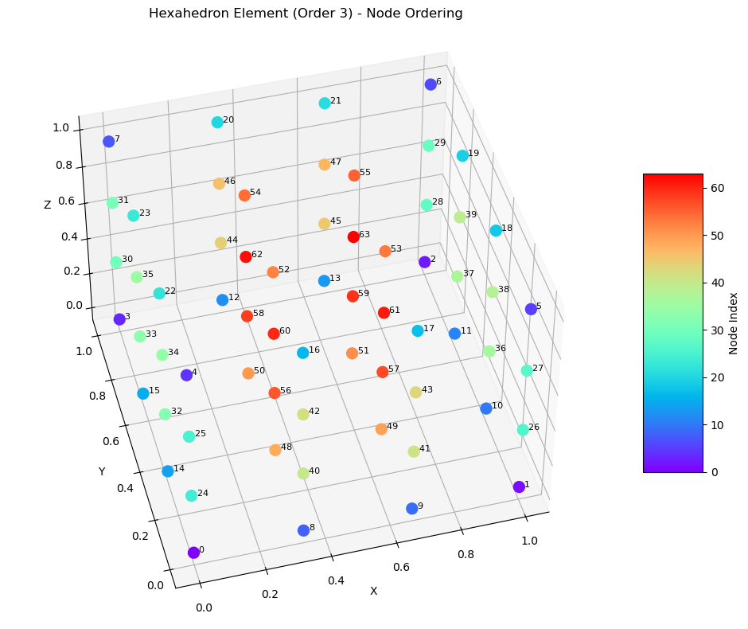

# Higher-Order Lagrange Finite Elements for ParaView and VTK

Generating and visualizing higher-order Lagrange finite elements for ParaView
and VTK. 

*Example visualization of a higher-order hexahedral Lagrange element. To match
the hexhedral node numbering [from this blog
post](https://www.kitware.com/modeling-arbitrary-order-lagrange-finite-elements-in-the-visualization-toolkit/).*

## Requirements

- Python 3 (tested with Python 3.11)
- Required packages:
  - `numpy` - numerical computations
  - `vtk` - VTK file generation
  - `matplotlib` - 3D visualization

## Node ordering convention

All elements follow VTK's Lagrange element node ordering:
1. **Corner vertices** first
2. **Edge nodes** second (in VTK edge order)
3. **Face nodes** third (for 3D elements)
4. **Interior nodes** last (for higher orders)

This ensures compatibility with ParaView, VTK, and other software like Petsc's DMPlex.

## References

- [Modeling Arbitrary-order Lagrange Finite Elements in the Visualization
  Toolkit](https://www.kitware.com/modeling-arbitrary-order-lagrange-finite-elements-in-the-visualization-toolkit/)
- [VTK File
  Formats](https://vtk.org/wp-content/uploads/2015/04/file-formats.pdf) See
  figure 3.
- [Non-linear cell types in the VTK
  book](https://book.vtk.org/en/latest/VTKBook/05Chapter5.html#nonlinear-types)
- Seemingly outdated node numbering was used in this [CoreForm blog
  post](https://www.kitware.com/implementation-of-rational-bezier-cells-into-vtk/),
  which mentioned that the VTK implementation may not fully align with the latest
  developments in finite element modeling.

# Changelog

All notable changes to this project will be documented below.

## [1.1] - 2025-08-06

General maintenance, including:

- Formatting
- Adding license
- Adding documentation and references

Also, bugfix for hexahedral edge ordering. See also the [comment
here](https://www.kitware.com/modeling-arbitrary-order-lagrange-finite-elements-in-the-visualization-toolkit/#comment-1875)
on the original kitware blogpost. Note that the original hexahedral ordering
followed this [blog post from
CoreForm](https://www.kitware.com/implementation-of-rational-bezier-cells-into-vtk/),
but this verison changes it to the convention in the [original VTK blog
post](https://www.kitware.com/modeling-arbitrary-order-lagrange-finite-elements-in-the-visualization-toolkit).

## [1.0] - 2020-03-20

Original working version.